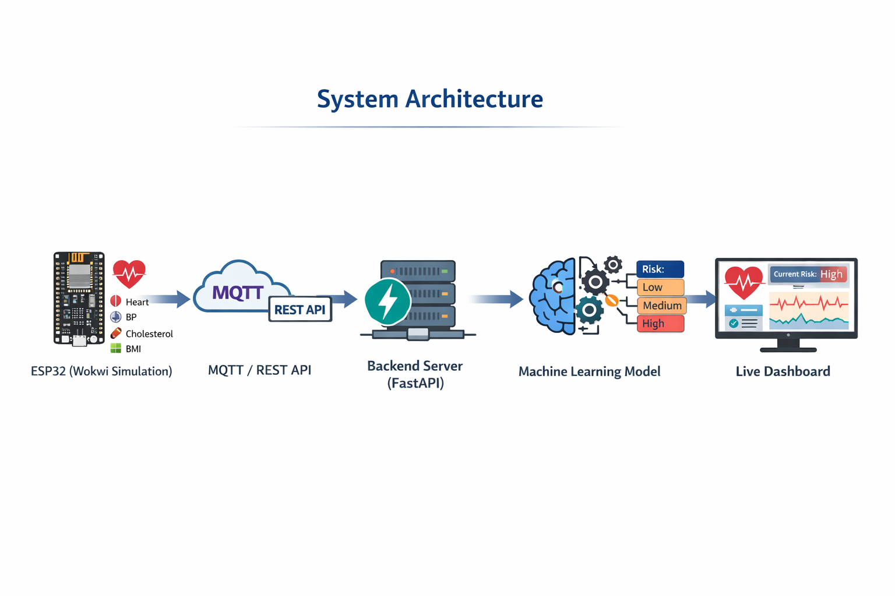

# IoT-Based Heart Disease Risk Prediction System 💓⚠️

This project presents a real-time heart disease risk prediction system that integrates **IoT simulation, MQTT communication, and Machine Learning**. It demonstrates how AI can enhance IoT-based healthcare monitoring systems.

---

## Project Overview

The system simulates real-time patient health data using an ESP32 (via Wokwi), transmits it using MQTT, processes it through a backend ML model, and visualizes the results on a live dashboard.

---

## Key Features

- 📡 Real-time data simulation using ESP32 (Wokwi)
- 🔄 MQTT-based communication (lightweight IoT protocol)
- 🤖 Machine Learning model for prediction
- 🧾 Patient-specific data handling
- 📊 Live dashboard visualization (Streamlit)
- ⚡ Event-driven backend (FastAPI + MQTT subscriber)

---

## 🏗️ System Architecture

---

## Dataset

- Dataset used: Framingham Heart Study Dataset  
- Source: Kaggle [Link](https://www.kaggle.com/datasets/aasheesh200/framingham-heart-study-dataset)
- Target: `TenYearCHD` (10-year coronary heart disease risk)

---

## Machine Learning Model

- Algorithm: XGBoost Classifier
- Preprocessing:
  - Missing value handling
  - Feature scaling (StandardScaler)
  - Class imbalance handling (SMOTE)
- Output:
  - `0` → Low Risk  
  - `1` → High Risk  

---

## IoT Simulation

- Platform: Wokwi
- Device: ESP32 (MicroPython)
- Simulated parameters:
  - Systolic BP
  - Diastolic BP
  - Heart Rate
  - Glucose

---

## MQTT Communication

- Protocol: MQTT
- Broker: Public broker (Mosquitto)
- Topic: `health/patient/data`

---
